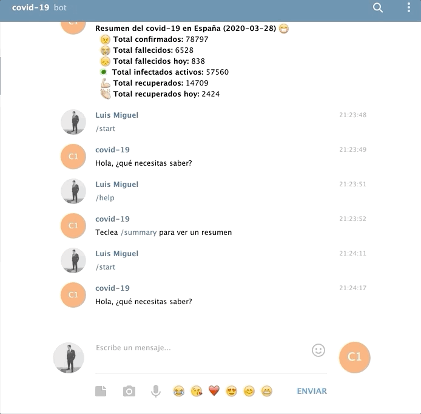

# Telecovid
Un simple bot para telegram que resume toda la información actual sobre el corona virus en españa.

1º npm install
2º Añade tu token de telegram en el archivo config.js
3º Lanzar el modulo covid.bot.js

Demo

